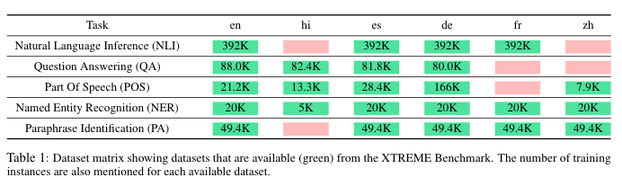

## Meta-Learning for Effective Multi-task and Multilingual Modelling
Link to the paper - https://arxiv.org/abs/2101.10368
(Appearing at EACL 2021 as Oral Presentation)

### Abstract
<code>Natural language processing (NLP) tasks (e.g. question-answering in English) benefit from 
knowledge of other tasks (e.g. named entity recognition in English) and knowledge of other
languages (e.g. question-answering in Spanish). Such shared representations are typically
learned in isolation, either across tasks or across languages. In this work, we propose a 
meta-learning approach to learn the interactions between both tasks and languages. We also
investigate the role of different sampling strategies used during meta-learning. We present
experiments on five different tasks and six different languages from the XTREME multilingual
benchmark dataset. Our meta-learned model clearly improves in performance compared to competitive
baseline models that also include multi-task baselines. We also present zero-shot evaluations on
unseen target languages to demonstrate the utility of our proposed model.</code>

### Main Contributions

* We present a meta-learning approach that enables effective sharing of parameters across multiple tasks and multiple languages. This is the first work, to our knowledge, to explore the interplay between multiple tasks at different levels of abstraction and multiple languages using meta-learning. We show results on the recently-released XTREME benchmark and observe consistent improvements across different tasks and languages using our model. We also offer rules of thumb for effective meta-learning that could hold in larger settings involving additional tasks and languages. 
* We investigate different sampling strategies that can be incorporated within our meta-learning approach and examine their benefits.
* We evaluate our meta-learned model in zero-shot settings for every task on target languages that never appear during training and show its superiority compared to competitive zero-shot baselines.

### Dataset and Directory Structure

We use the recently released [XTREME](https://github.com/google-research/xtreme) benchmark for dataset. We choose a subset of 5 tasks - Question Answering, Natural Language Answering, Paraphrase Identification, Part-of-Speech Tagging and Named Entity Recognition and 6 languages - English, Hindi, French, Chinese, Spanish and German for our experiments. For Zero-shot evaluations we use other available languages from these tasks. The authors of XTREME were kind enough to provide us with the in-house translated-train datasets whenever not publically available.

`datapath.py` lists all dataset files used in the paper. The naming of datasets is done using XX_YY where XX is the task - Question Answering (qa), Natural language inference (sc), Paraphrase identification (pa), Part-of-speech tagging (po) and Named entity recognition (tc), and YY is the language - English (en), Hindi (hi),... etc

The table below taken from the paper summarises the grid of task-language pair datasets - red entries are not available and green entries highlight the size of train split


### Experiments

We use MBERT (bert-base-multilingual-cased) as the base model with task specific layers on top. We use default parameter values from transformers repository and only vary the meta learning parameters i.e `task_per_queue`, `update_steps`, `beta` and `meta_epochs`. For more details refer to section 4.2 of the paper.
After performing grid search on these meta learning parameters we found the best combination to be `--task_per_queue 8 --update_steps 3 --beta 1.0 --meta_epochs 3`

#### Sampling

`--meta_tasks` command line argument refers to the TLPs which will be used in training. `--meta_tasks qa` means all TLPs belonging to QA (i.e qa_en, qa_hi, qa_es, qa_de) will be used. `--meta_tasks qa_en` means only qa_en will be used in meta training. You can also select a custom subset of TLPs like this `--meta_tasks qa_en,sc_en,tc_hi,pa_de`

**Temperature Sampling**

All TLPs with temperature = 5.0
```
python3 main.py --meta_tasks sc,pa,qa,tc,po --temp 5.0
```
QA only with temperature = 1.0
```
python3 main.py --meta_tasks qa --temp 1.0
```

**DDS Sampling** 

`--update_dds` refers to the number of steps of meta training after which update dds psi's. 
`--dds_lr` is the learning rate for updating dds psi's.
`--K` is the number of batches sampled from train and dev tasks to calculate the cosine similarity. 
`--dev_tasks` are subset of tasks on which reward for a particular TLP is averaged over.

```
python3 main_dds.py --meta_tasks sc,pa,qa,tc,po --dev_tasks sc,pa,qa,tc,po --update_dds 10 --K 1 --dds_lr 0.01
```

#### Baseline & Finetuning

The parameters for finetuning and baseline are task specific (refer to Appendix A and B in the paper).

Baseline
```
python3 baseline.py --task sc_en --epochs 3 
```
Finetuning
```
python3 baseline.py --load PATH/TO/MODEL --task sc_en --epochs 2
```

#### Multi-task 

`multitask.py` can be run exactly similar to `main.py` file. The difference being training step for multitask learning updates the parameter based on the optimiser step unlike meta learning where the actual update is done using meta step.
```
python3 multitask.py --meta_tasks sc,pa,qa,tc,po
```
(ignore the command name `--meta_tasks`. it is kept for easy of running commands across different files)

#### Zero-shot Experiments

We evaluate trained meta models in zero-shot setting on multiple languages for each task. The list of zero-shot languages for each task can be found in `datapath.py` file under the key `test`. The below command evaluates the model on NER for Tamil

```
python3 zeroshot.py --load PATH/TO/MODEL --task tc_ta
```

--------
#### Contact
Ishan Tarunesh - ishantarunesh@gmail.com <br>
Sushil Khyalia - skhyalia2014@gmail.com
